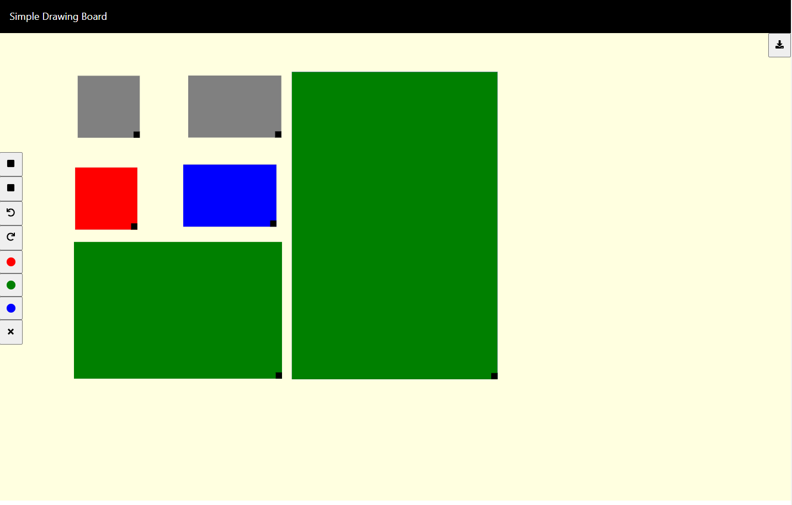

# Overview

This project is bootstrapped with [Create React App](https://github.com/facebook/create-react-app). \
This is a simple Drawing board web application build using ReactJS with MobX for state management. \
The application has the following features:
- Draw two shapes, Square and Rectangle.
- Resize the shapes.
- Drag and move the shapes.
- Apply colors to the shapes by selecting any shape.
- Undo and Redo options.
- Export the drawings as HTML file.  
- Clear the drawing board.

# Getting started

## Available Scripts

In the project directory, you can run:

### `npm install`

### `npm start`

Runs the app in the development mode.\
Open [http://localhost:3000](http://localhost:3000) to view it in your browser.

The page will reload when you make changes.\
You may also see any lint errors in the console.

